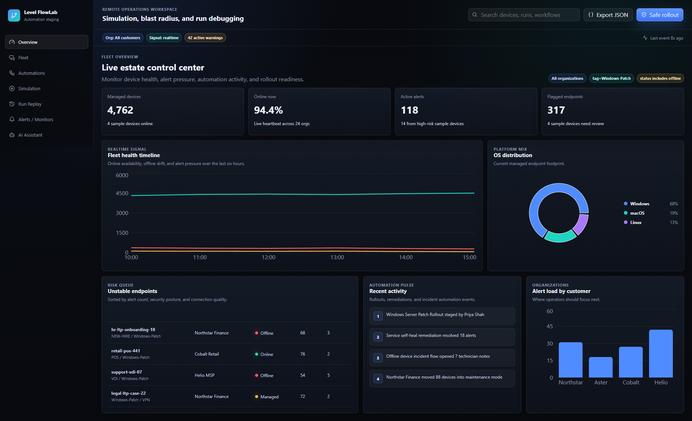
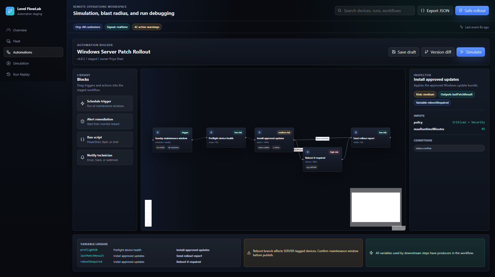
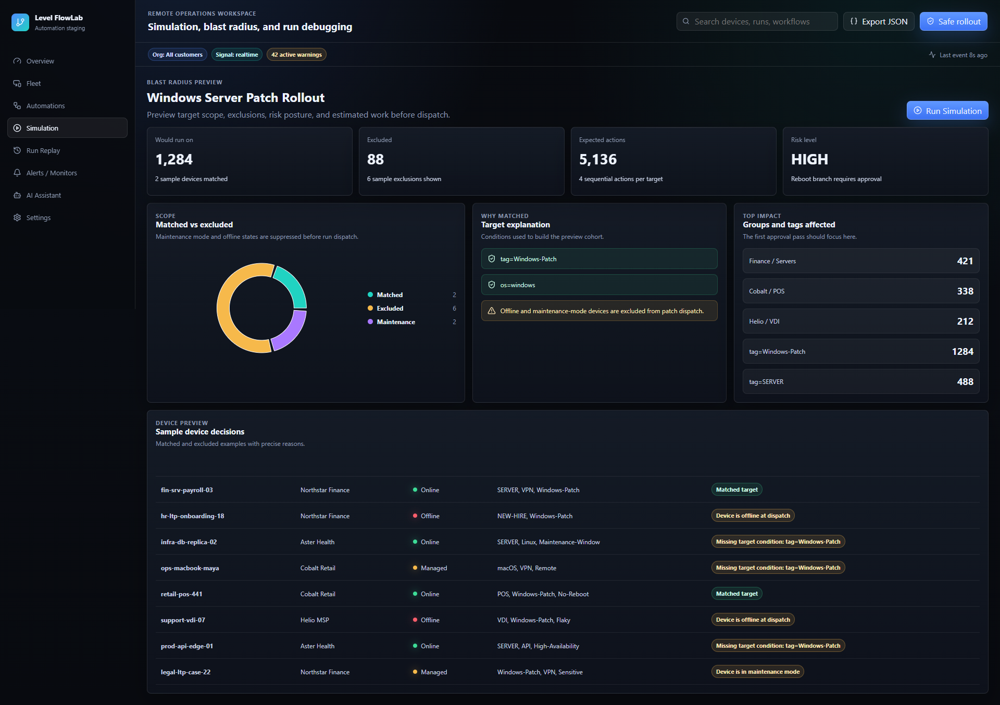
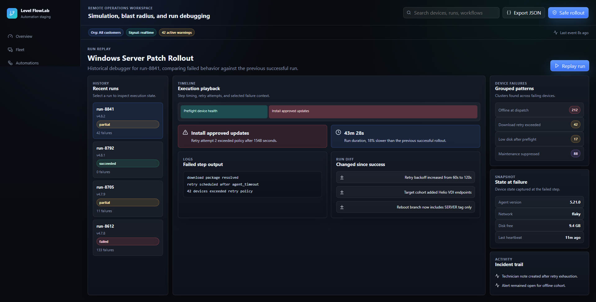
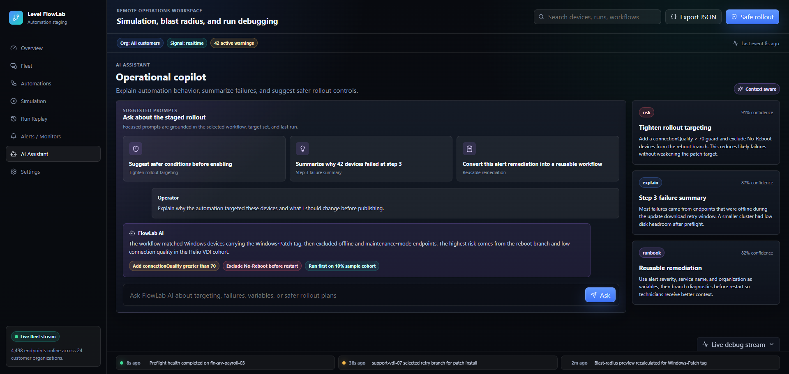

# Level FlowLab

Level FlowLab is a simulation, blast-radius analysis, and run-debugging workspace for RMM automations. It helps IT teams preview which devices a workflow will affect, validate workflow logic, inspect variables and conditions, and replay historical runs before and after deployment.

Live site: https://levelflow-lab-web-x43k.vercel.app/

## Product Overview

Remote monitoring and management automations can be powerful, but risky when they act across large device fleets. FlowLab gives IT admins, MSP operators, and support teams a safe staging layer for automation workflows.

Instead of guessing whether a workflow will hit too many devices, skip a step, retry unexpectedly, or fail for an entire device cohort, FlowLab makes those decisions visible before rollout and debuggable after execution.

## Screenshots

### Overview



### Automation Builder



### Step-by-Step Simulation



### Run Replay



### AI Assistant



## Core Capabilities

- Visual Automation Builder: a node-based canvas for triggers, sequential actions, conditions, retries, warnings, and variable lineage.
- Blast Radius Preview: a preflight view of matched devices, excluded devices, maintenance-mode conflicts, affected groups/tags, and rollout risk.
- Step-by-Step Simulation: a debugger-style dry run with inputs, outputs, variables, conditions, retry paths, and decision traces.
- Run Replay: a historical debugger for failed and partial automation runs, including timelines, logs, grouped failure patterns, run diffs, and state snapshots.
- AI Assistant: an embedded operational copilot that explains targeting, summarizes failures, suggests safer rollout conditions, and drafts runbook-style guidance.
- Fleet Overview: an operations dashboard showing live estate health, OS mix, alert load, risky endpoints, maintenance mode, and automation activity.

## Screens

### Fleet Overview

The overview screen acts as the live estate control center. It surfaces managed device counts, online/offline distribution, platform mix, active alerts, risky endpoints, recent automation activity, and organization-level alert pressure.

### Automation Builder

The builder is the primary workspace for designing automations. It includes a left block library, central workflow canvas, right-side inspector, top workflow toolbar, validation drawer, risk badges, condition chips, and variable lineage mapping.

### Blast Radius Preview

The preview screen answers what will happen before dispatch. It shows which devices match, which are excluded, why they were excluded, which groups and tags are affected, and whether the workflow carries elevated rollout risk.

### Simulation Console

The simulation console provides single-device dry-run debugging. Operators can step through each workflow action, inspect inputs and outputs, review variables available at that point, and understand why a retry, skip, or failure path was selected.

### Run Replay

The replay debugger focuses on historical incidents. It shows run history, failed-step highlighting, timing, logs, grouped device failures, state at failure, and differences from previous successful runs.

### AI Assistant

The assistant is designed as an operational copilot rather than a generic chatbot. It uses the current workflow, target set, and run history context to explain behavior and recommend safer rollout options.

## Architecture

```txt
apps/
  web/                  Next.js app shell and product screens
  api/                  Mock GraphQL BFF resolver boundary
packages/
  mock-data/            Realistic fleet, workflow, run, trend, and AI sample data
  workflow-engine/      Typed workflow models, condition evaluation, blast radius, simulation
  graphql-schema/       GraphQL schema SDL for the BFF boundary
  ui/                   Shared package placeholder for future extracted UI primitives
docs/
  architecture.md
  product-spec.md
  screenshots/
  decisions/
```

## Tech Stack

- Next.js
- React
- TypeScript
- React Flow for workflow canvas interactions
- Zustand for local simulation/debug state
- Recharts for dashboard and preview visualization
- Vitest for workflow-engine logic tests
- GraphQL SDL and mock resolvers for the BFF boundary

## Domain Model

FlowLab models the core automation concepts needed for simulation and debugging:

- `Device`: OS, status, organization, group path, tags, security score, maintenance mode, connection quality, and alert count.
- `Workflow`: name, version, owner, publication state, triggers, target conditions, and action sequence.
- `ActionNode`: action type, conditions, inputs, outputs, retry policy, risk level, and estimated duration.
- `SimulationResult`: matched devices, excluded devices, step traces, risk level, and estimated duration.
- `HistoricalRun`: run status, timings, failed step, device counts, logs, attempts, and step outputs.
- `AiInsight`: prompt, summary, confidence, and recommendation category.

## Workflow Engine

The workflow engine lives in `packages/workflow-engine` and keeps product logic outside the UI. It currently supports:

- condition evaluation
- exclusion reason generation
- blast-radius preview
- single-device step simulation
- retry-path selection
- fleet summary counters

## Mock Data

The mock dataset in `packages/mock-data` includes realistic organizations, devices, tags, workflows, trends, run history, and AI insights. The data is intentionally credible so the UI feels like a real operations product instead of a placeholder dashboard.

## Getting Started

Install dependencies:

```bash
npm install --workspaces --include-workspace-root
```

Run the web app:

```bash
npm run dev
```

Build for production:

```bash
npm run build
```

Run tests:

```bash
npm run test
```

Run type checks:

```bash
npm run typecheck
```

## Verification

The workflow-engine Vitest suite covers:

- condition evaluation
- maintenance-mode blast-radius exclusion
- fleet summary counters
- retry-path simulation for low connection quality

The app has also been built successfully with `npm run build`.

## Design Goals

FlowLab is intentionally designed as a dense, premium, desktop-first operations product. The UI emphasizes:

- clarity under complexity
- fast scanning for technical users
- visible risk before destructive actions
- strong information hierarchy
- real-time awareness
- debugging affordances
- polished enterprise SaaS presentation

## Tradeoffs

- The MVP is frontend-first and uses deterministic mock data so the product UX and domain model remain the focus.
- The GraphQL layer is represented by schema and resolver boundaries rather than a full running backend service.
- Real-time behavior is mocked with local state and a live debug drawer; it can later be backed by SSE or WebSocket events.
- AI behavior is represented with contextual mocked insights rather than a live model integration.

## Future Work

- Automation revision comparison.
- Policy-aware recommendations based on monitor and alert trends.
- Safe rollout mode with sampled cohorts.
- Cohort simulation across multiple device shapes.
- Run anomaly detection.
- Remote-session correlation for automations that require technician intervention.
